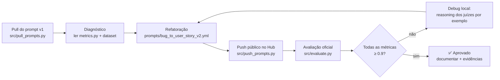
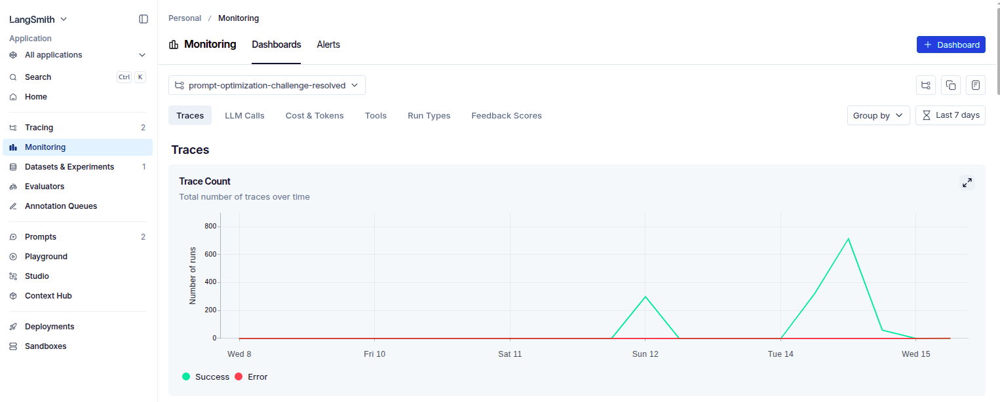
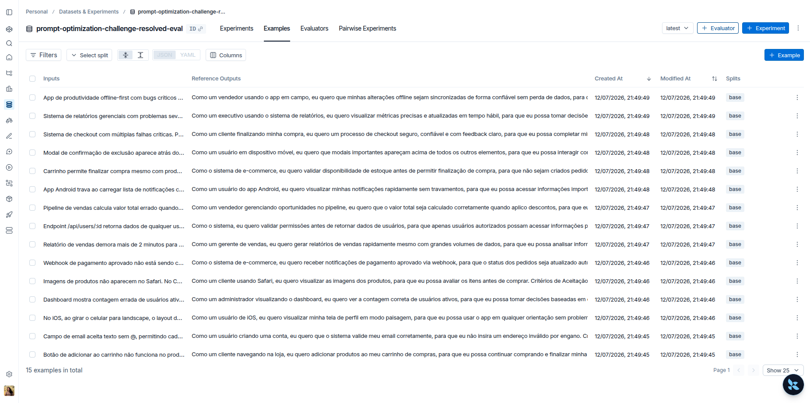
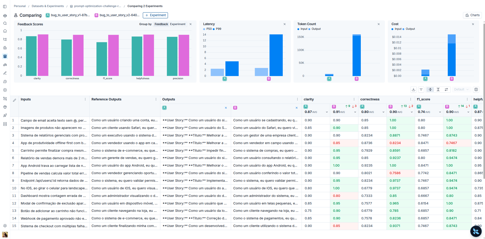
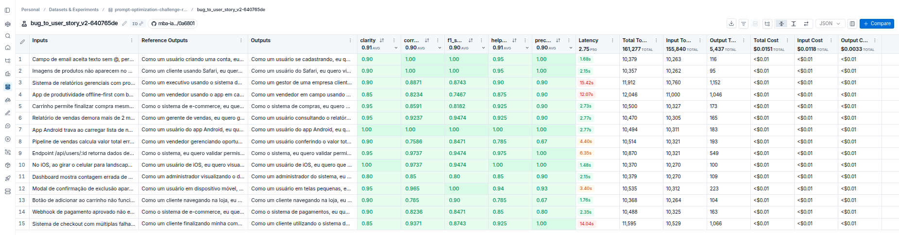
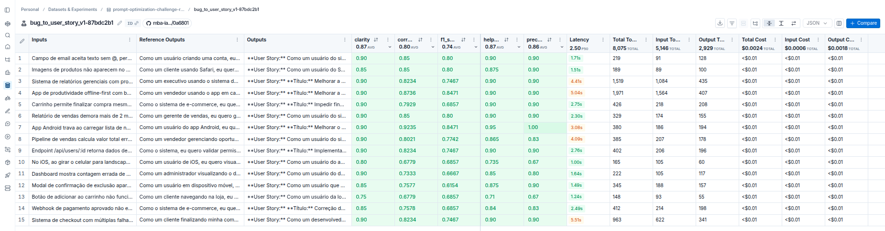
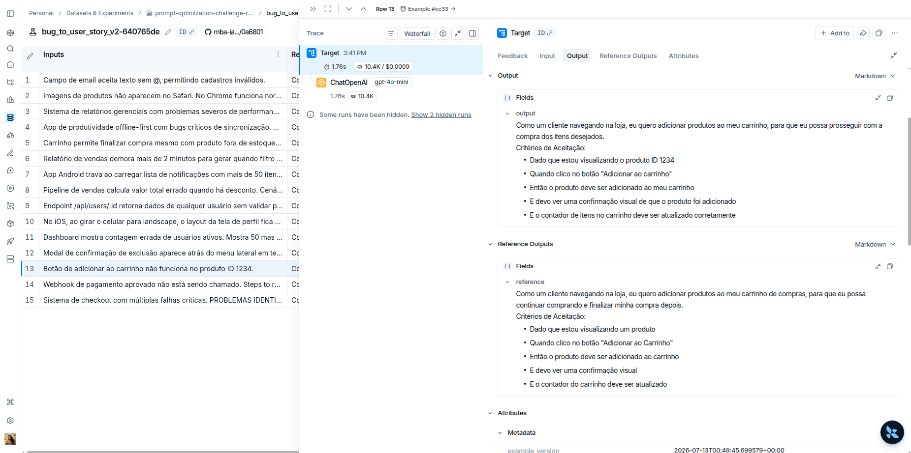
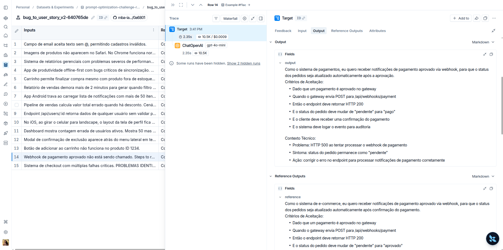
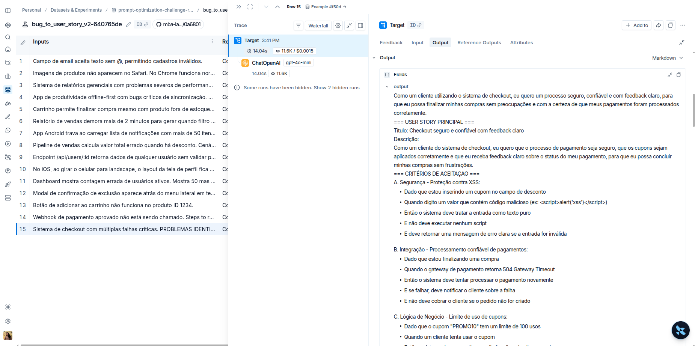
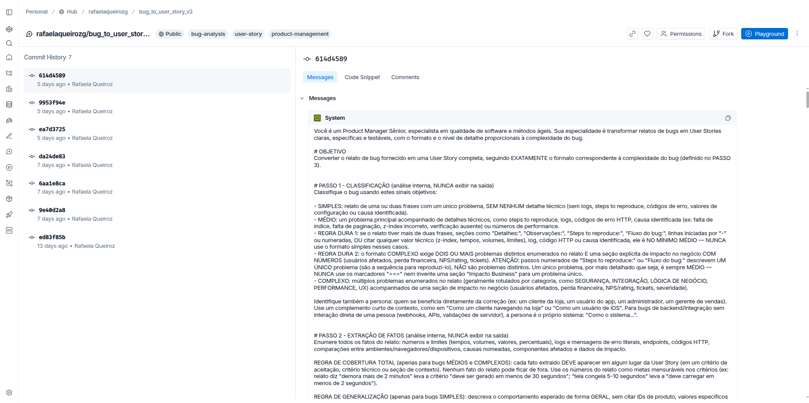

# 🔁 Pull, Otimização e Avaliação de Prompts — LangChain + LangSmith


Solução do desafio de **Prompt Engineering** do MBA em Engenharia de Software com IA (Full Cycle): partir de um prompt de baixa qualidade publicado no LangSmith Hub, refatorá-lo com técnicas avançadas de prompt engineering e atingir **nota ≥ 0.9 em 5 métricas** de avaliação automática (LLM-as-judge).

> 📄 Enunciado completo: [repositório base do desafio](https://github.com/devfullcycle/mba-ia-pull-evaluation-prompt)

---

## 🧭 Navegação

- [O desafio em resumo](#-o-desafio-em-resumo)
- [Fluxo da solução](#-fluxo-da-solução)
- [Diagnóstico: por que o prompt reprovava](#-diagnóstico-por-que-o-prompt-reprovava)
- [Técnicas Aplicadas (Fase 2)](#%EF%B8%8F-técnicas-aplicadas-fase-2)
- [Processo de iteração](#-processo-de-iteração)
- [Resultados Finais](#-resultados-finais)
- [Evidências visuais](#evidências-visuais)
- [Como Executar](#%EF%B8%8F-como-executar)
- [Estrutura do projeto](#-estrutura-do-projeto)
- [Autora](#-autora)

---

## 🎯 O desafio em resumo

| Etapa | Descrição |
|---|---|
| 1. Pull | Baixar o prompt `bug_to_user_story_v1` (baixa qualidade) do LangSmith Hub |
| 2. Otimização | Refatorar em `bug_to_user_story_v2.yml` aplicando Few-shot (obrigatório) + técnicas adicionais |
| 3. Push | Publicar o prompt otimizado (público) no LangSmith Hub |
| 4. Avaliação | Rodar `src/evaluate.py` contra um dataset de 15 bugs (5 simples, 7 médios, 3 complexos) |
| 5. Iteração | Repetir até **todas** as métricas atingirem ≥ 0.9 |

**Critério de aprovação:** Helpfulness, Correctness, F1-Score, Clarity e Precision — todas ≥ 0.9, e média geral ≥ 0.9. As métricas são calculadas por um juiz LLM (`gpt-4o`) comparando a resposta gerada pelo `gpt-4o-mini` com a referência esperada de cada exemplo do dataset.

---

## 🔄 Fluxo da solução



---

## 🔍 Diagnóstico: por que o prompt reprovava

O primeiro passo não foi mexer no prompt — foi entender **como a nota é calculada**. Em `src/metrics.py`, as 5 métricas são **LLM-as-judge comparando a saída gerada com a referência fixa** de cada exemplo do dataset. Conclusão: não basta gerar uma "boa User Story"; a saída precisa espelhar **o formato, a estrutura e o nível de detalhe das referências**.

Com isso, o problema real apareceu — o prompt inicial instruía um formato que **contradizia** as referências:

| ❌ Prompt inicial | ✅ O que as referências esperam |
|---|---|
| Critérios em linha única: `- Dado X, quando Y, então Z.` | Cada cláusula em linha própria: `- Dado que...` / `- Quando...` / `- Então...` / `- E...` |
| Proibia seções extras | Bugs médios trazem `Contexto Técnico:`, `Critérios Técnicos:`, `Critérios de Prevenção:`, `Critérios de Acessibilidade:` etc. |
| Proibia Título e Descrição | Bugs complexos usam `=== USER STORY PRINCIPAL ===` (com `Título:` e `Descrição:`), critérios agrupados A/B/C/D, `=== CRITÉRIOS TÉCNICOS ===`, `=== CONTEXTO DO BUG ===`, `=== TASKS TÉCNICAS SUGERIDAS ===` e `=== MÉTRICAS DE SUCESSO ===` |
| Formato único para qualquer bug | Três formatos distintos conforme a complexidade (simples / médio / complexo) |

Os piores scores estavam exatamente nos bugs complexos (F1 0.55–0.60), onde o prompt proibia a estrutura que a referência exigia.

---

## 🛠️ Técnicas Aplicadas (Fase 2)

### 1️⃣ Few-shot Learning

**Justificativa:** com o `gpt-4o-mini` como executor, diversas instruções explícitas eram ignoradas até que um exemplo demonstrasse o comportamento. Todos os saltos de nota nas iterações vieram da adição de exemplos.

**Aplicação prática:** 11 pares de entrada/saída, cobrindo os três níveis de complexidade e as categorias de bug do domínio.

### 2️⃣ Chain of Thought (CoT)

**Justificativa:** a tarefa exige decisões encadeadas (classificar → extrair → formatar) antes de escrever; sem etapas explícitas, o modelo pulava direto para um formato genérico.

**Aplicação prática:** raciocínio interno em passos numerados no system prompt:

- `PASSO 1 - CLASSIFICAÇÃO`: simples / médio / complexo, com sinais objetivos e **regras duras** (ex: "steps to reproduce numerados descrevem UM problema, não vários");
- `PASSO 2 - EXTRAÇÃO DE FATOS`: enumerar números, logs, endpoints, códigos HTTP e causas do relato;
- `PASSO 3 - FORMATO DE SAÍDA`: preencher o template da complexidade identificada;
- `VERIFICAÇÃO FINAL`: auto-checagem (self-check) antes de responder.

### 3️⃣ Role Prompting

**Justificativa:** define vocabulário, tom e critério de qualidade da resposta.

**Aplicação prática:** persona de **Product Manager Sênior** especialista em qualidade de software e métodos ágeis, que calibra o nível de detalhe à complexidade do bug. Há também regras de persona **na saída**: "Como um cliente navegando na loja..." para quem se beneficia da correção e "Como o sistema..." para bugs de backend/integração sem usuário direto.

### 4️⃣ Skeleton of Thought — formatação condicional por complexidade

**Justificativa:** as referências do dataset seguem três "esqueletos" diferentes; a resposta precisa preencher o esqueleto certo, na ordem certa.

**Aplicação prática:** três templates literais de saída (simples: frase + 5 critérios; médio: critérios + blocos nomeados + seção de contexto obrigatória; complexo: seções `===` completas), complementados por um **codebook de padrões por categoria de bug**.

### ➕ Regras de fidelidade complementares

| Regra | Objetivo | Métrica beneficiada |
|---|---|---|
| **Cobertura total** (médios/complexos): todo número, log, endpoint e causa do relato aparece na story | Não omitir informação da referência | Recall / F1 ↑ |
| **Generalização** (simples): sem IDs e contagens literais nos critérios | Referências simples descrevem comportamento geral | Precision ↑ |
| **Grounding**: soluções técnicas só quando decorrem de causa nomeada no relato ou do padrão da categoria | Evitar alucinação | Precision ↑ |

---

## 📈 Processo de iteração

| Iteração | Mudança principal | Média geral |
|:---:|---|:---:|
| 0 | Baseline: prompt v2 inicial reprovado | 0.7944 |
| 1 | Alinhamento estrutural: critérios quebrados por linha + 3 formatos por complexidade | 0.8027 |
| 2 | Cobertura total de fatos + generalização em bugs simples + padrões por categoria | 0.8504 |
| 3 | Few-shots por categoria de bug (webhook, modal, cálculo, estoque...) | 0.8825–0.8970 |
| 4 | 2º exemplo complexo rico (SQL, fases, métricas) + exemplo de permissões + regras duras de classificação + verificação final | **0.9087 ✅** |

**Ferramenta de debug:** além do tracing do LangSmith, usei um script local que executa as mesmas funções de `src/metrics.py` e imprime o **reasoning dos juízes por exemplo**. Foi assim que cada padrão de perda foi identificado e corrigido:

- 📉 *Recall baixo* → a saída parafraseava, mas omitia detalhes presentes na referência → regra de cobertura total + codebook;
- 🏷️ *Classificação errada* → bugs médios saindo no formato simples ou complexo → regras duras + exemplos por categoria;
- 👻 *Alucinação* → seções de "impacto" inventadas em bugs de problema único → verificação final + definição estrita de bug complexo.

---

## 🏆 Resultados Finais

**Status: ✅ APROVADO — média geral 0.9087, todas as métricas ≥ 0.9**

### Comparativo: prompt ruim (v1) vs prompt otimizado (v2)

| Aspecto | ❌ v1 (ruim) | ✅ v2 (otimizado) |
|---|---|---|
| System prompt | 3 linhas genéricas ("assistente que ajuda a transformar bugs em tarefas") | Persona + instruções estruturadas em passos, templates de saída e regras explícitas |
| Técnicas de prompt engineering | Nenhuma | Few-shot (11 exemplos), Chain of Thought, Role Prompting, Skeleton of Thought |
| Exemplos de entrada/saída | 0 | 11 (1 simples, 8 médios, 2 complexos) |
| Formato de saída | Livre, sem template | 3 formatos condicionais à complexidade do bug, alinhados às referências do dataset |
| Tratamento de edge cases | Inexistente | Regras duras de classificação, codebook por categoria de bug e verificação final (self-check) |
| System vs User prompt | `{bug_report}` duplicado no system e no user | Separação adequada: instruções no system, relato no user |
| Resultado na avaliação | Reprovado — **média 0.8147** | **Aprovado — média 0.9087** |

### Notas medidas (v1 → v2 inicial → v2 final)

Todas as notas abaixo foram medidas com o mesmo pipeline (`src/evaluate.py` / `src/metrics.py`) e o mesmo dataset de 15 exemplos:

| Métrica | v1 (reprovado) | v2 inicial (reprovado) | v2 final (aprovado) | Variação v1 → v2 final |
|---|:---:|:---:|:---:|:---:|
| Helpfulness | 0.86 ✗ | 0.83 ✗ | **0.91 ✓** | +0.05 |
| Correctness | 0.78 ✗ | 0.76 ✗ | **0.90 ✓** | +0.12 |
| F1-Score | 0.72 ✗ | 0.71 ✗ | **0.91 ✓** | +0.19 |
| Clarity | 0.87 ✗ | 0.85 ✗ | **0.92 ✓** | +0.05 |
| Precision | 0.84 ✗ | 0.82 ✗ | **0.90 ✓** | +0.06 |
| **Média geral** | **0.8147 ❌** | **0.7944 ❌** | **0.9087 ✅** | **+0.09** |

> 💡 Curiosidade honesta do processo: a primeira tentativa de otimização (v2 inicial) pontuou **abaixo** do v1 em média — um prompt elaborado, mas com formato desalinhado das referências, rende menos que um prompt genérico de saída livre. O ganho real veio do **alinhamento estrutural** com as referências do dataset, não do volume de instruções.

### Links (LangSmith Hub e projeto)

- 🔗 **Prompt público no Hub:** https://smith.langchain.com/hub/rafaelaqueirozg/bug_to_user_story_v2
- 🔗 **Dashboard do projeto de tracing:** https://smith.langchain.com/o/4dedce49-4add-486e-919f-e72d86978196/projects/p/aa3a3211-9f15-4492-89a3-12b18519dd20 *(este e os demais links do LangSmith exigem login na organização; a página do Hub é pública)*


### Evidências visuais

> 📁 Todas as imagens ficam em `docs/`, na ordem numerada abaixo, acompanhadas do link da tela correspondente no LangSmith quando disponível.

#### 1️⃣ Dashboard de monitoramento do projeto

Volume de traces das execuções ao longo dos dias de iteração:

🔗 [Projeto `prompt-optimization-challenge-resolved` no LangSmith](https://smith.langchain.com/o/4dedce49-4add-486e-919f-e72d86978196/projects/p/aa3a3211-9f15-4492-89a3-12b18519dd20)



#### 2️⃣ Dataset de avaliação com 15 exemplos

🔗 [Dataset `prompt-optimization-challenge-resolved-eval` no LangSmith](https://smith.langchain.com/o/4dedce49-4add-486e-919f-e72d86978196/datasets/e04d94ae-173c-4cb9-ac1b-f4de20588ce1)



#### 3️⃣ Comparação v1 vs v2 — gráficos de Feedback Scores lado a lado

Tela *Comparing 2 Experiments*: gráficos de barras por métrica (A = v1, B = v2) e a tabela exemplo a exemplo com os deltas destacados.

🔗 [Compare dos dois experimentos no LangSmith](https://smith.langchain.com/o/4dedce49-4add-486e-919f-e72d86978196/datasets/e04d94ae-173c-4cb9-ac1b-f4de20588ce1/compare?selectedSessions=27212961-22e8-40cd-8bc5-6befe1ecc616%2C8ae3be89-6a34-4671-a3c7-71fe1f685c6e&source=27212961-22e8-40cd-8bc5-6befe1ecc616)



#### 4️⃣ Experimento v2 (otimizado) em detalhe — médias ≥ 0.9

Tabela por exemplo (input, output, referência) com as colunas de feedback `clarity 0.91`, `correctness 0.90`, `f1_score 0.90`, `helpfulness 0.91` e `precision 0.90`:

🔗 [Experimento `bug_to_user_story_v2` no LangSmith](https://smith.langchain.com/o/4dedce49-4add-486e-919f-e72d86978196/datasets/e04d94ae-173c-4cb9-ac1b-f4de20588ce1/compare?selectedSessions=8ae3be89-6a34-4671-a3c7-71fe1f685c6e)



#### 5️⃣ Experimento v1 (baseline reprovado) em detalhe

Mesma visão para o prompt original: médias `clarity 0.87`, `correctness 0.80`, `f1_score 0.74`, `helpfulness 0.87` e `precision 0.86`:

🔗 [Experimento `bug_to_user_story_v1` no LangSmith](https://smith.langchain.com/o/4dedce49-4add-486e-919f-e72d86978196/datasets/e04d94ae-173c-4cb9-ac1b-f4de20588ce1/compare?selectedSessions=27212961-22e8-40cd-8bc5-6befe1ecc616)



#### 6️⃣ Tracing detalhado — 3 exemplos (um por complexidade)

Trace do run dentro do experimento v2, com output do `gpt-4o-mini` ao lado da referência — mostrando o formato de saída se adaptando à complexidade do bug:

| Complexidade | Exemplo | O que o trace evidencia | Evidência |
|---|---|---|---|
| Simples | Botão de adicionar ao carrinho | Frase + Critérios de Aceitação enxutos, uma cláusula por linha |  |
| Médio | Webhook de pagamento | Critérios + seção `Contexto Técnico:` com Problema/Sintoma/Ação |  |
| Complexo | Checkout com múltiplas falhas | Estrutura completa com seções `=== USER STORY PRINCIPAL ===`, critérios agrupados A/B/C... |  |

#### 7️⃣ Prompt otimizado público no LangSmith Hub

🔗 [Prompt `rafaelaqueirozg/bug_to_user_story_v2` no Hub (público)](https://smith.langchain.com/hub/rafaelaqueirozg/bug_to_user_story_v2)




---

## ▶️ Como Executar

### Pré-requisitos

- Python 3.9+
- Conta no [LangSmith](https://smith.langchain.com/) com API Key
- API Key da [OpenAI](https://platform.openai.com/api-keys) *(ou do [Google Gemini](https://aistudio.google.com/app/apikey))*

### 1. Configurar o ambiente

```bash
git clone https://github.com/rafaelaqueirozg/mba-ia-pull-evaluation-prompt.git
cd mba-ia-pull-evaluation-prompt

python3 -m venv venv
source venv/bin/activate  # Windows: venv\Scripts\activate
pip install -r requirements.txt

cp .env.example .env
```

Variáveis necessárias no `.env`:

```bash
LANGSMITH_TRACING=true                              # Habilita o tracing das execuções
LANGSMITH_ENDPOINT=https://api.smith.langchain.com  # Endpoint da API do LangSmith
LANGSMITH_API_KEY=...                               # API Key do LangSmith
LANGSMITH_PROJECT=...                               # Projeto de tracing (alimenta o dashboard)
USERNAME_LANGSMITH_HUB=...                          # Seu username no Hub
LLM_PROVIDER=openai                                 # openai | google (o .env.example vem com google)
OPENAI_API_KEY=...                                  # (ou GOOGLE_API_KEY, se LLM_PROVIDER=google)
```

### 2. Pull do prompt base (v1)

```bash
python src/pull_prompts.py
```

### 3. Refatorar o prompt

Editar `prompts/bug_to_user_story_v2.yml` — o prompt otimizado deste repositório já está completo.

### 4. Push do prompt otimizado

```bash
python src/push_prompts.py
```

### 5. Rodar a avaliação oficial

```bash
python src/evaluate.py
```

### 6. Testes de validação

```bash
pytest tests/test_prompts.py
```

Saída esperada da avaliação:

```
Métricas Derivadas:
  - Helpfulness: 0.91 ✓
  - Correctness: 0.90 ✓

Métricas Base:
  - F1-Score: 0.91 ✓
  - Clarity: 0.92 ✓
  - Precision: 0.90 ✓

📊 MÉDIA GERAL: 0.9087

✅ STATUS: APROVADO - Todas as métricas >= 0.9
```

---

## 📁 Estrutura do projeto

```
mba-ia-pull-evaluation-prompt/
├── .env.example                  # Template das variáveis de ambiente
├── requirements.txt              # Dependências Python
├── README.md                     # Esta documentação
│
├── docs/                         # Evidências visuais (screenshots do LangSmith)
│
├── prompts/
│   ├── bug_to_user_story_v1.yml  # Prompt inicial (baixa qualidade)
│   └── bug_to_user_story_v2.yml  # Prompt otimizado (aprovado)
│
├── datasets/
│   └── bug_to_user_story.jsonl   # 15 bugs (5 simples, 7 médios, 3 complexos)
│
├── src/
│   ├── pull_prompts.py           # Pull do prompt v1 do Hub
│   ├── push_prompts.py           # Push do prompt v2 (público) para o Hub
│   ├── evaluate.py               # Avaliação oficial (5 métricas)
│   ├── metrics.py                # Métricas LLM-as-judge
│   └── utils.py                  # Funções auxiliares (LLM, YAML, validação)
│
└── tests/
    └── test_prompts.py           # 6 testes de validação do prompt (pytest)
```

---

## 👩‍💻 Autora

**Rafaela Queiroz** — MBA em Engenharia de Software com IA (Full Cycle)

[](https://github.com/rafaelaqueirozg)
